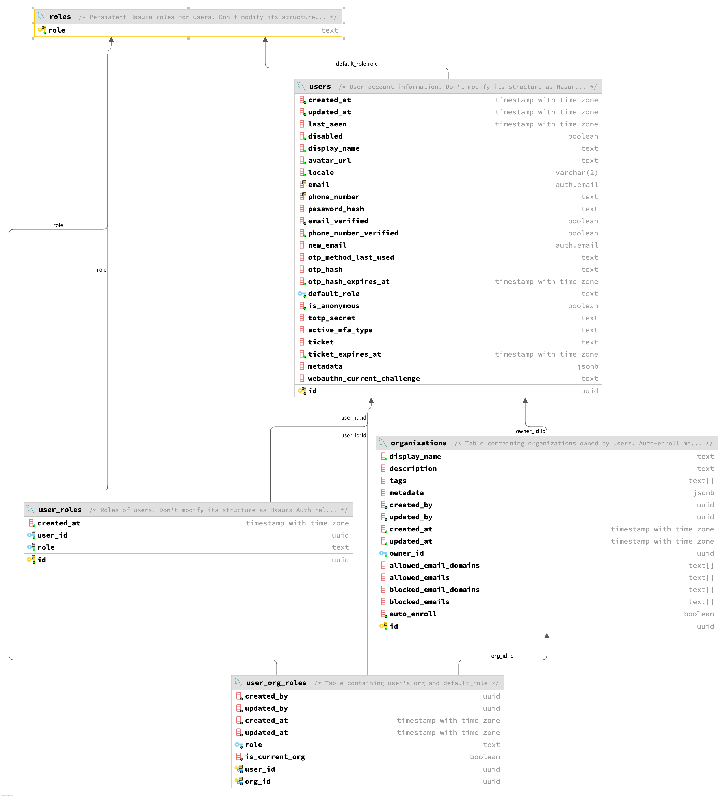

# nHost multi-tenant experiment


Based on https://github.com/viktorfa/nhost-saas-boilerplate/tree/main


## Start

```shell
nhost down --volumes
nhost up --apply-seeds
```

### Export Seeds

```shell
hasura seed create 001_roles --database-name default --from-table auth.roles --endpoint https://local.hasura.local.nhost.run --admin-secret hasura-admin-secret
hasura seed create 002_users --database-name default --from-table auth.users --endpoint https://local.hasura.local.nhost.run --admin-secret hasura-admin-secret
hasura seed create 003_user_roles --database-name default --from-table auth.user_roles --endpoint https://local.hasura.local.nhost.run --admin-secret hasura-admin-secret
hasura seed create 004_orgs --database-name default --from-table public.orgs --endpoint https://local.hasura.local.nhost.run --admin-secret hasura-admin-secret
hasura seed create 005_org_userss --database-name default --from-table public.org_users --endpoint https://local.hasura.local.nhost.run --admin-secret hasura-admin-secret
hasura seed create 005_user_profiles --database-name default --from-table public.user_profiles --endpoint https://local.hasura.local.nhost.run --admin-secret hasura-admin-secret
```


## Test

Switch `current_org_user` in `public.user_profiles` table between `1ad7bdf6-084a-44ff-b643-15fe6ee47383` (OWNER) and `f53dfbf7-bf04-4b5e-9adf-1e3ce7b3d514` (MEMBER) and test below **SignIn** request
```sql
UPDATE public.user_profiles
SET current_org_user = 'f53dfbf7-bf04-4b5e-9adf-1e3ce7b3d514'
WHERE user_id = '193c2cac-6a22-4e9c-b5f8-93fe464c9875';
```

```http
### SignIn
# @name signIn
POST {{authEndpoint}}/signin/email-password
Content-Type: application/json

{
  "email": "{{userEmail}}",
  "password": "{{userPassword}}"
}
```

Response
```
HTTP/1.1 200 OK
Access-Control-Allow-Origin: *
Cache-Control: no-store, no-cache, must-revalidate, proxy-revalidate
Content-Length: 1454
Content-Type: application/json; charset=utf-8
Date: Sat, 30 Nov 2024 23:36:27 GMT
Etag: W/"5ae-XOZL78xLtqSMVpAicUPBsH53oKw"
Expires: 0
Pragma: no-cache
Strict-Transport-Security: max-age=15552000; includeSubDomains
Surrogate-Control: no-store
X-Content-Type-Options: nosniff
X-Dns-Prefetch-Control: off
X-Download-Options: noopen
X-Frame-Options: SAMEORIGIN
X-Xss-Protection: 1; mode=block
Connection: close

{
  "session": {
    "accessToken": "eyJhbGciOiJIUzI1NiJ9.eyJodHRwczovL2hhc3VyYS5pby9qd3QvY2xhaW1zIjp7IngtaGFzdXJhLU9yZy1JZCI6IjQwNmE2ZmM2LWVjYjktNGYwZi05ODEyLThhMmFiYjcxNzUyMCIsIngtaGFzdXJhLU9yZy1JZHMiOiJ7XCI0ZjA3M2M2Ni1lOWU1LTRmNmMtYTQyNS1hNDhlZDZmZDFlMDRcIixcIjQwNmE2ZmM2LWVjYjktNGYwZi05ODEyLThhMmFiYjcxNzUyMFwifSIsIngtaGFzdXJhLU9yZy1Vc2VyLUlkIjoiZjUzZGZiZjctYmYwNC00YjVlLTlhZGYtMWUzY2U3YjNkNTE0IiwieC1oYXN1cmEtdXNlci1lbWFpbCI6InN1bW8uc3BlY2llc0BnbWFpbC5jb20iLCJ4LWhhc3VyYS1hbGxvd2VkLXJvbGVzIjpbIm1lIiwidXNlciIsIk1FTUJFUiJdLCJ4LWhhc3VyYS1kZWZhdWx0LXJvbGUiOiJNRU1CRVIiLCJ4LWhhc3VyYS11c2VyLWlkIjoiMTkzYzJjYWMtNmEyMi00ZTljLWI1ZjgtOTNmZTQ2NGM5ODc1IiwieC1oYXN1cmEtdXNlci1pcy1hbm9ueW1vdXMiOiJmYWxzZSJ9LCJzdWIiOiIxOTNjMmNhYy02YTIyLTRlOWMtYjVmOC05M2ZlNDY0Yzk4NzUiLCJpYXQiOjE3MzMwMDk3ODcsImV4cCI6MTczMzAxMDY4NywiaXNzIjoiaGFzdXJhLWF1dGgifQ.xAfrPwfVT9Q71Y7Dj1_11uL3p_dzKpJORA4GphXY9_8",
    "accessTokenExpiresIn": 900,
    "refreshToken": "7b360365-c32d-4aaf-9a89-b76396549adf",
    "refreshTokenId": "4aa0ec9c-211d-4085-ba22-c87e3b6bbcb0",
    "user": {
      "id": "193c2cac-6a22-4e9c-b5f8-93fe464c9875",
      "createdAt": "2024-11-30T22:39:24.230415+00:00",
      "displayName": "Sumo Species",
      "avatarUrl": "https://s.gravatar.com/avatar/8c1122211b5cb0e743da6404e4e9243b?r=g&default=mp",
      "locale": "en",
      "email": "sumo.species@gmail.com",
      "isAnonymous": false,
      "defaultRole": "MEMBER",
      "metadata": {},
      "emailVerified": false,
      "phoneNumber": null,
      "phoneNumberVerified": false,
      "activeMfaType": null,
      "roles": [
        "me",
        "user"
      ]
    }
  },
  "mfa": null
}
```

```json
{
  "https://hasura.io/jwt/claims": {
    "x-hasura-Org-Id": "406a6fc6-ecb9-4f0f-9812-8a2abb717520",
    "x-hasura-Org-Ids": "{\"4f073c66-e9e5-4f6c-a425-a48ed6fd1e04\",\"406a6fc6-ecb9-4f0f-9812-8a2abb717520\"}",
    "x-hasura-Org-User-Id": "f53dfbf7-bf04-4b5e-9adf-1e3ce7b3d514",
    "x-hasura-user-email": "sumo.species@gmail.com",
    "x-hasura-allowed-roles": [
      "me",
      "user",
      "MEMBER"
    ],
    "x-hasura-default-role": "MEMBER",
    "x-hasura-user-id": "193c2cac-6a22-4e9c-b5f8-93fe464c9875",
    "x-hasura-user-is-anonymous": "false"
  },
  "sub": "193c2cac-6a22-4e9c-b5f8-93fe464c9875",
  "iat": 1733009787,
  "exp": 1733010687,
  "iss": "hasura-auth"
}
```

## Schema



## Limitations 

- we have to use _hasura-auth_ version `'0.26.0'` to make this work, because after `'0.26.0'` _hasura-auth_ will use `go` lang and `SQL` to query data instead of `GraphQL` with give us flexibility
- create new use may not work, because, we tampered `default_role` metadata in `auth.users` table and used `computed_fields` in place of it.